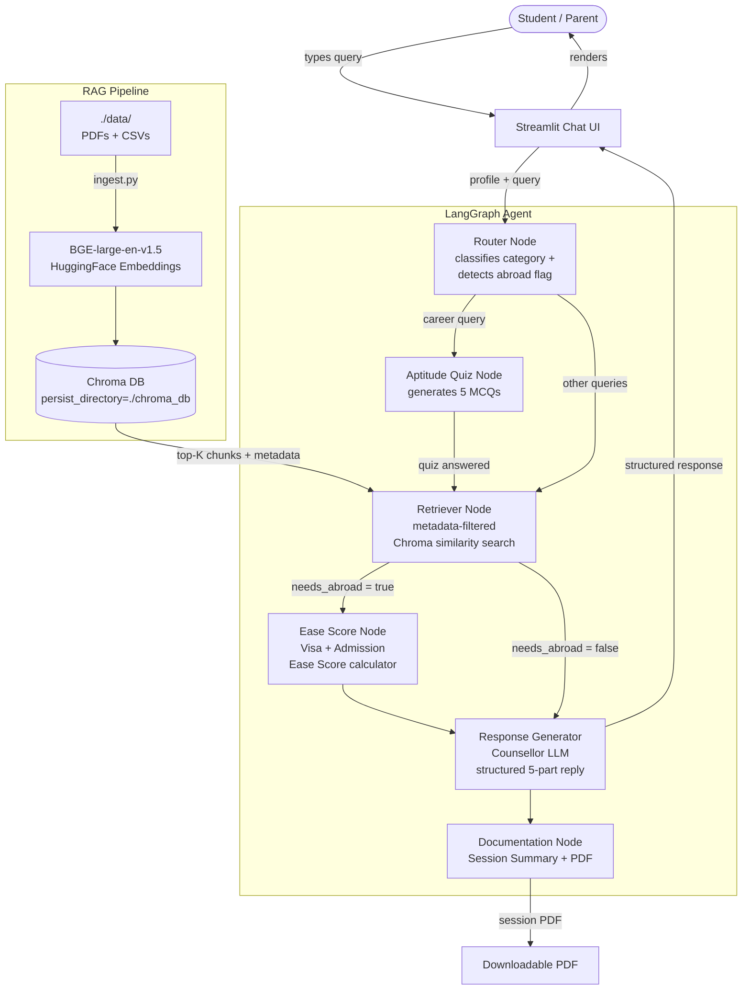

#  CounsellAI
> **RAGxthon 2026 Submission** — A full-stack AI Education Counsellor for Indian students built with LangChain, LangGraph, Chroma, and Streamlit.

[](https://python.org)
[](https://streamlit.io)
[](https://langchain-ai.github.io/langgraph/)
[](LICENSE)

---

## What is CounsellAI?

CounsellAI is a conversational AI agent that **replaces every responsibility of a human education counsellor** for Indian students (Class 10–12, undergrad, and study-abroad aspirants). It combines:

- Indian university & board exam data
- Global university rankings + visa statistics
- Career placement datasets
- Study-habit & wellness guides

…to deliver **empathetic, evidence-backed, fully cited** counselling sessions — and saves every session as a **downloadable PDF record**.

---

## Architecture Diagram



---

## RAG Pipeline Explained

| Step | What happens |
|------|-------------|
| **1. Ingest** | `ingest.py` scans `./data/`, loads PDFs via `PyPDFLoader` and CSVs via `CSVLoader`, splits into 800-token overlapping chunks |
| **2. Metadata enrichment** | Every chunk gets `{category, country, source, filename, page}` metadata via keyword heuristics |
| **3. Embedding** | `BAAI/bge-large-en-v1.5` (local, free, SOTA for retrieval) with cosine-normalised vectors |
| **4. Persist** | Stored in `ChromaDB` at `./chroma_db` with collection name `counsellai` |
| **5. Retrieval** | Metadata-filtered `similarity_search(k=6)` — career queries filter to career+admissions chunks; India-only queries exclude abroad data |
| **6. Generation** | Retrieved context injected into the structured `COUNSELOR_SYSTEM_PROMPT` alongside student profile |
| **7. Citation** | Every source chunk is labelled `[Source: filename, p.N]` and rendered in the UI |

---

## Counsellor Responsibilities → Feature Mapping

| Counsellor Responsibility | CounsellAI Feature |
|--------------------------|-------------------|
| **Academic Guidance** | Courses, study plans, performance improvement via academic-filtered RAG |
| **Career Counselling** | 5-question aptitude quiz + placement data retrieval + career stream suggestions |
| **Personal Support** | Empathetic response + mandatory licensed counsellor disclaimer + helpline numbers |
| **Admissions Assistance** | India + abroad college shortlisting, entrance exam timelines, Ease Score for Indian passport |
| **Collaboration** | Parent/Teacher tips + letter templates in every response |
| **Documentation** | Auto-generated PDF session record downloadable after every reply |

---

## Project Structure

```
CounsellAI/
├── data/                  ← Place your PDF and CSV datasets here
│   ├── jee_colleges.pdf
│   ├── visa_stats.csv
│   └── ...
├── chroma_db/             ← Auto-created by ingest.py
├── session_records/       ← Auto-created; PDF session records saved here
├── ingest.py              ← One-time data ingestion pipeline
├── app.py                 ← Streamlit app + LangGraph agent
├── prompts.py             ← All LLM prompts in one place
├── requirements.txt
└── README.md
```

---

## Quick Start

### 1. Clone & install

```bash
git clone https://github.com/your-username/CounsellAI.git
cd CounsellAI
pip install -r requirements.txt
```

### 2. Add your datasets

Place any PDF or CSV files related to Indian/global education into `./data/`:
```
data/
├── indian_colleges_ranking.pdf
├── jee_neet_cutoffs.csv
├── visa_rejection_rates.pdf
├── career_streams_placement.csv
├── study_abroad_guide.pdf
└── mental_wellness_students.pdf
```

### 3. Set API keys

```bash
# Option A – environment variables
export OPENAI_API_KEY="sk-..."        # GPT-4o-mini
# OR
export GROQ_API_KEY="gsk_..."         # Llama-3.1-70B (free tier available)

# Option B – Streamlit secrets
mkdir -p .streamlit
echo 'OPENAI_API_KEY = "sk-..."' >> .streamlit/secrets.toml
```

### 4. Ingest data

```bash
python ingest.py
# To wipe and re-ingest from scratch:
python ingest.py --reset
```

### 5. Launch the app

```bash
streamlit run app.py
```

Open [http://localhost:8501](http://localhost:8501) in your browser.

---

## Key Features

### LangGraph Agentic Flow
6-node graph with conditional routing — not a simple chain. The agent decides whether to run the aptitude quiz, compute an ease score, or go straight to response generation based on query classification.

### Aptitude Quiz Simulator
For career queries, CounsellAI auto-generates 5 MCQs across logical, verbal, numerical, spatial, and interest dimensions — rendered as an interactive Streamlit form — before giving career guidance.

### Visa + Admission Ease Score
For abroad queries, the dedicated Ease Score node uses retrieved visa rejection statistics to generate a personalised `High / Medium / Low` score table for the student's target countries, considering their academic profile, IELTS score, and budget.

### Session PDF Records
Every conversation turn produces a clean, branded PDF session record (generated with `fpdf2`) — satisfying the Documentation requirement of the counsellor job description.

### Metadata-Filtered Retrieval
Chunks carry `{category, country, source, page}` metadata. Retrieval is filtered so a student asking about Indian colleges never gets Canadian visa data mixed in (unless they ask for it).

---

## Safety & Ethics

- Personal/mental health responses **always** include a disclaimer: *"This is general advice. For serious concerns, please consult a licensed counsellor or helpline."*
- Indian helpline numbers (**iCall: 9152987821**, **Vandrevala Foundation: 1860-2662-345**) are prominently displayed in the sidebar.
- The agent is instructed to **never hallucinate** — it uses only retrieved context and clearly states when information is not available.
- All session records are stored locally; no student data is sent to third parties beyond the LLM API call.

---

## Tech Stack

| Component | Technology |
|-----------|-----------|
| LLM | GPT-4o-mini (OpenAI) / Llama-3.1-70B (Groq) |
| Agentic Framework | LangGraph |
| RAG Framework | LangChain |
| Vector Store | ChromaDB |
| Embeddings | `BAAI/bge-large-en-v1.5` (HuggingFace, local) |
| UI | Streamlit |
| PDF Loaders | PyPDFLoader, CSVLoader |
| PDF Generation | fpdf2 |
| Text Splitting | RecursiveCharacterTextSplitter |

---

## Hackathon Submission Checklist

- [x] GitHub repository with all source code
- [x] Architecture diagram (Mermaid, see above)
- [x] Clear RAG pipeline explanation (see table above)
- [x] All 6 counsellor responsibilities implemented and mapped
- [x] LangGraph multi-node agentic flow
- [x] Metadata-filtered Chroma retrieval
- [x] BGE-large-en-v1.5 local embeddings
- [x] Aptitude quiz simulator
- [x] Visa + Admission Ease Score for Indian passport
- [x] Session PDF documentation
- [x] Safety disclaimers for personal topics
- [x] Beautiful Streamlit UI with sidebar profile builder

---

## Screenshots

> Add screenshots of the running app here for your hackathon submission.

1. **Chat interface** with structured 5-part counsellor response
2. **Aptitude quiz** rendered as interactive form
3. **Ease Score table** for abroad queries
4. **Downloaded PDF** session record

---

## 
License

MIT License — free to use, modify, and distribute with attribution.

---

*Built with love for RAGxthon 2026 · Powered by LangChain + LangGraph + ChromaDB*
